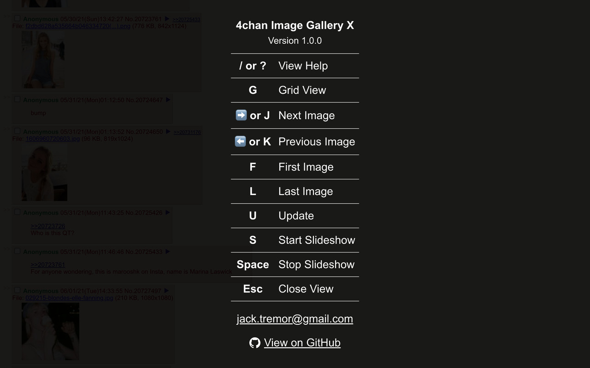
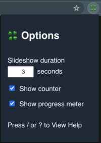

# 4chan Image Gallery X

## 🔗 <a href="https://chrome.google.com/webstore/detail/4chan-image-gallery-x/anjkdophjmhbeleohejgenccljbmlcpf?hl=en-US">Get Chrome Extension</a>

## ✨ Features
* Displays thread in grid view
* Click an image to display full screen
* Use keyboard shortcuts to display next/previous image
* Nice cross-fade transition between images
* Resizes large images to fit inside browser window
* Support WEBM videos
* Slideshow mode will cycle through images
* Displays progress meter for next image or WEBM position
* Works on both 4chan.org and 4channel.org

## 📸 Screenshots

## ⚙️ Options

## ⏳ Keyboard Shortcuts

<table>
  <tr><td>/ or ?</td><td>View Help</td></tr>
  <tr><td>G</td><td>Grid View</td></tr>
  <tr><td>➡️ or J</td><td>Next Image</td></tr>
  <tr><td>⬅️ or K</td><td>Previous Image</td></tr>
  <tr><td>F</td><td>First Image</td></tr>
  <tr><td>L</td><td>Last Image</td></tr>
  <tr><td>U</td><td>Update</td></tr>
  <tr><td>S</td><td>Start Slideshow</td></tr>
  <tr><td>Space</td><td>Stop Slideshow</td></tr>
  <tr><td>Esc</td><td>Close View</td></tr>
</table>
